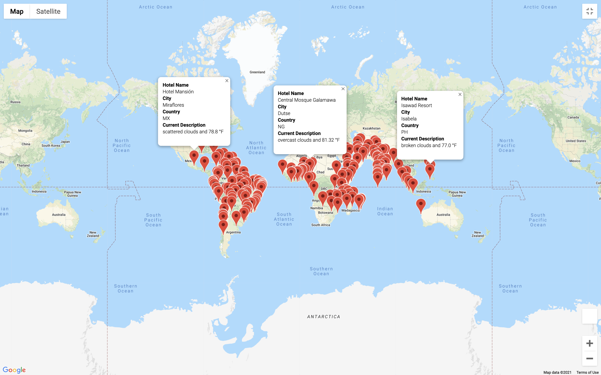

# world_weather_analysis
# Background and Purpose
We were assigned to add on to our PlanMyTrip app to make the app even more functional and interactive.  We were tasked to add things such as, the weather description for specific cities, potential travel destinations and to create a travel route between the four cities  as well as a marker layer map to display the data.

# How we got the data:
We were able to use both the open weather API as well as the google directions and places API to create the app.  After conducting the analysis using numpy to generate 2000 random latitudes and longitudes we exported the final data frames into csv files.
## CSV files:
1. [WeatherPy_vacation](vacation_search/WeatherPy_vacation.csv)
2. [cities](weather_data/cities.csv)
3. [WeatherPy_Database](Weather_Database/WeatherPy_Database.csv)

# How the app works:
Our code allows us to generate random coordinates around the globe that would search for potential vacation destinations based of the users input of maximum temperature and minimum temperature wanted for their trip.  With these inputs the code will output a dataframe with the preferred cities and will also collect the data from the API for the weather conditions in the city.

# Travel Destination Map:
In this map we were able to display markers on the map which represented the possible travel destinations as well as nearby hotels and current weather conditions in the city. In order to create this we needed to use the Google Maps and places API as well as the search nearby API.

# Travel Itinerary Map:
Below are two images of the maps we created to display a travel route between four different vacation destinations as well as the popup markers that describe the collected data for the specific city.

